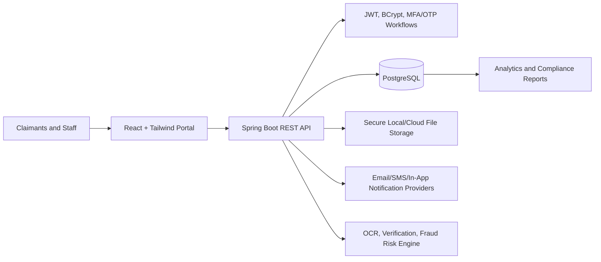
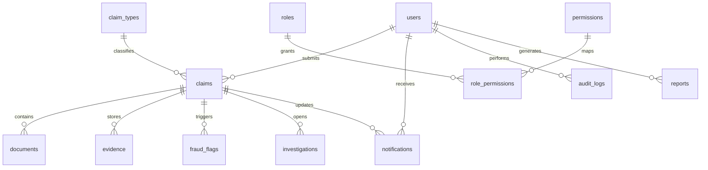
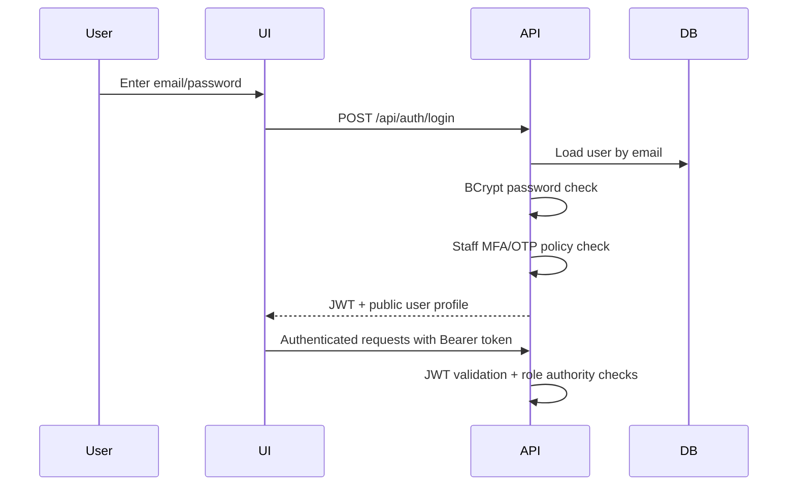
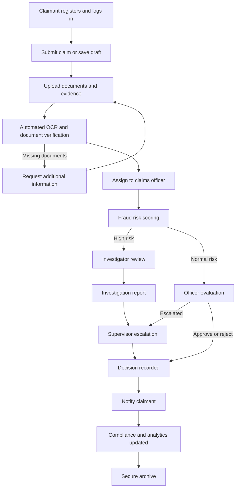
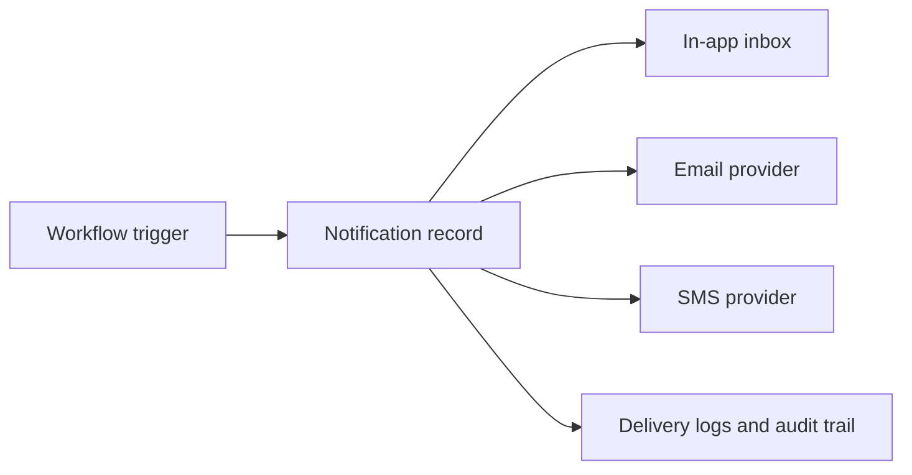

# Prime Insurance LTD Digital Claims Processing, Verification & Analytics System

## 1. System Architecture

The implemented workspace uses a React/Vite frontend with Tailwind CSS and a Spring Boot API backend. The backend provides the same enterprise API responsibilities requested for a Node/Express service: JWT authentication, RBAC-protected endpoints, claim processing, uploads, analytics, notifications, and PostgreSQL persistence.

## 2. UI/UX Dashboard Design

The frontend is organized around enterprise modules and role dashboards:

- Public portal: landing, claimant registration, login, forgot password, OTP verification, help, contact.
- Claimant dashboard: submit claims, upload documents/evidence, track timeline, notifications, history, profile.
- Agent dashboard: assisted intake, assigned clients, upload documents, communication.
- Claims officer dashboard: verification queue, review workspace, approve/reject/request info, escalation.
- Supervisor dashboard: escalated claims, final decisions, SLA monitoring, workload reassignment.
- Investigator dashboard: flagged claims, risk scoring, pattern visualization, investigation notes.
- Compliance dashboard: audit explorer, regulatory templates, exports, scheduled reports.
- Administrator dashboard: user creation, role and permission management, security settings, logs, analytics.

Primary routes live in `frontend/src/routes/router.tsx`; reusable layouts, sidebar, topbar, metric cards, and role content live under `frontend/src/components`.

## 3. Database Schema / ERD

Core tables:

- `users`, `roles`, `permissions`, `role_permissions`
- `claims`, `claim_types`
- `documents`, `evidence`
- `fraud_flags`, `investigations`
- `notifications`
- `audit_logs`, `login_audit_logs`
- `reports`
- `otp_verifications`, `password_resets`

The SQL definition is in `backend/src/main/resources/schema.sql`.

## 4. API Structure

Authentication:

- `POST /api/auth/login`
- `POST /api/auth/register`
- `POST /api/auth/password-reset/request`
- `POST /api/auth/password-reset/confirm`

Claims lifecycle:

- `GET /api/claims`
- `GET /api/claims/{claimId}`
- `POST /api/claims`
- `POST /api/claims/draft`
- `PATCH /api/claims/{claimId}/action`
- `POST /api/claims/{claimId}/attachments`
- `GET /api/claims/{claimId}/attachments/{documentId}/download`

Enterprise operations:

- `GET /api/analytics`
- `GET /api/notifications`
- `GET /api/events`
- `GET /api/users`
- `POST /api/users`
- `GET /health`

Recommended next API expansions:

- `GET/POST /api/fraud/flags`
- `GET/POST /api/investigations`
- `GET/POST /api/reports`
- `GET /api/audit-logs`
- `GET/POST /api/claim-types`
- `POST /api/auth/otp/verify`

## 5. Authentication Flow

Security controls:

- Claimants are the only self-registering users.
- Staff accounts are created by administrators.
- Passwords are BCrypt hashed.
- JWT is stateless and signed with `jwt.secret`.
- MFA/OTP and password reset tables are present for verification workflows.
- Account lockout, failed attempts, login logs, and CAPTCHA escalation fields are modeled.
- Sensitive upload metadata is separated into `documents` and `evidence` with audit trails.

## 6. Workflow Diagram

## 7. Role-Based Access Logic

- `claimant`: submit claims, upload own evidence, track own claims, notifications, profile.
- `agent`: assist claimant intake, upload documents, communicate, track assigned clients.
- `officer`: review claims, verify documents, make initial decisions, add notes, escalate.
- `supervisor`: final decision authority, workload reassignment, SLA monitoring.
- `fraud-investigator`: flagged queue, risk analysis, investigation reports, linked cases.
- `compliance-officer`: audit logs, compliance dashboard, regulatory reporting, exports.
- `admin`: staff creation, roles, permissions, security, integrations, reports, backups.

Frontend route access is enforced in `frontend/src/routes/ProtectedRoute.tsx`; backend method access is enforced with Spring Security authorities in controllers.

## 8. Backend Architecture

- `controller`: REST endpoints and HTTP-level validation.
- `service`: domain workflows, claim actions, uploads, seed data, mail delivery.
- `repository`: JDBC persistence against PostgreSQL.
- `security`: JWT filter, JWT service, password encoder, access denied handlers.
- `model`: request/response records and domain DTOs.
- `resources/schema.sql`: database schema and seed metadata.

## 9. Notification Workflow

Triggers include claim submitted, missing document request, verification override, fraud flag, escalation, approval, rejection, password reset, and staff account creation.

## 10. Analytics Dashboard

Analytics features are represented through:

- Claim volumes by status, region, claim type, and time period.
- Processing time and SLA breach indicators.
- Fraud score distribution and high-risk queues.
- Officer workload and supervisor performance monitoring.
- Compliance export and audit readiness metrics.
- Predictive insight placeholders for routing, delay, and fraud pattern detection.
