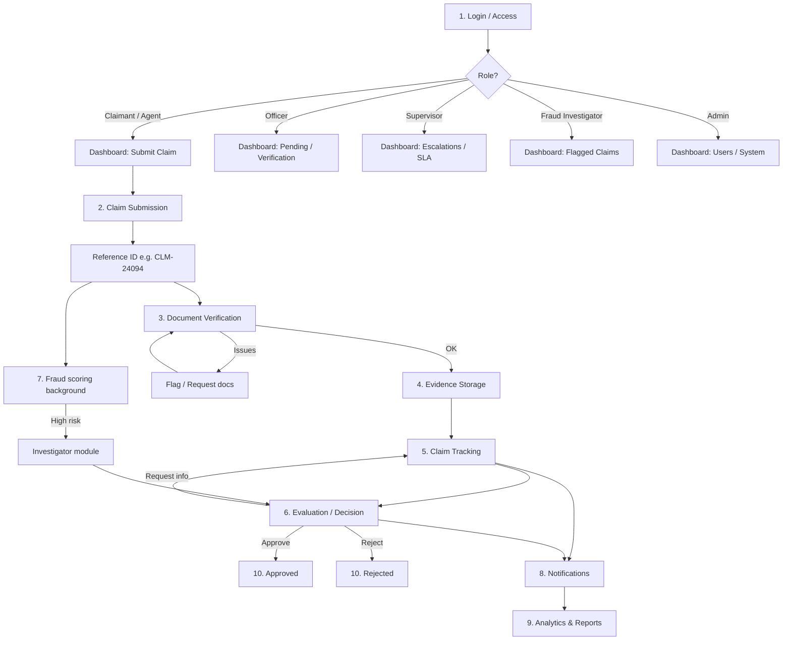

# Overall System Flow — Prime Claims Portal

How the end-to-end process works in this application (mapped to routes and APIs).

## Flow diagram



---

## Step-by-step (spec → implementation)

### 1. User login / access

| Spec | In app |
|------|--------|
| Login, check role, redirect to dashboard | `/login` → JWT → `/dashboard` |
| Claimant sees “Submit Claim” | Sidebar + dashboard activities → `/claims/new` |
| Officer sees “Pending Claims” | Dashboard “Verification queue” → `/verification` |
| Admin sees “System Control” | `/admin/users`, roles, security |

**Roles:** Claimant, Agent, Officer, Supervisor, Fraud Investigator, Admin.

**Staff:** password + optional email OTP (6-digit code on screen if Gmail SMTP fails).

---

### 2. Claim submission

| Spec | In app |
|------|--------|
| Claim type (auto / health / property) | `SubmissionPage` step form |
| Step-by-step + validation | Multi-step UI + required fields |
| Upload documents | Drag-drop → `POST /api/claims/{id}/attachments` |
| Save draft / submit | `Draft` vs `Pending` status |
| Reference number | Generated ID e.g. `CLM-24094` on create |

**API:** `POST /api/claims` (submit), draft endpoint, confirmation at `/claims/confirmation`.

---

### 3. Document verification (automatic + manual)

| Spec | In app |
|------|--------|
| Rules + AI/OCR check | Heuristic / client-side doc classification; full OCR TBD |
| Missing / fake / format issues | `aiStatus`: Valid / Flagged / Missing |
| Route forward or flag | Officer queue at `/verification` |
| Approve / reject / request info | `/verification/manual-approval`, claim actions |

**After submit:** status `Pending`, assigned team/officer, risk score calculated.

---

### 4. Evidence storage

| Spec | In app |
|------|--------|
| Secure folder per claim | Files under `data/claim-uploads` + DB metadata |
| Who / when uploaded | Document records + timeline entries |
| Gallery / witness / preview | `/evidence/gallery`, `/evidence/upload` |

---

### 5. Claim tracking (real-time)

| Spec | In app |
|------|--------|
| Status progression | `Draft` → `Pending` → `Under Review` / `Investigation` → `Approved` / `Rejected` |
| Timeline UI | `/tracking`, `/tracking/timeline`, claim detail |
| Real-time + SMS/email | In-app notifications yes; email needs SMTP; WebSocket/SMS not yet |

---

### 6. Claim evaluation (decision)

| Spec | In app |
|------|--------|
| Officer reviews claim + evidence + risk | `/evaluation/decision`, `/claims/:id` |
| Approve / Reject / Request info | `POST /api/claims/{id}/actions` |
| Audit trail | Timeline on claim + notifications |

**Status updates:**

- `approve` → **Approved**
- `reject` → **Rejected**
- `request-info` → **Pending** + “Action Needed” notification
- `escalate` → **Investigation** (supervisor)
- `investigate` → **Investigation** (fraud team)

---

### 7. Fraud detection (background)

| Spec | In app |
|------|--------|
| Risk score on submit | Computed in `ClaimDomainService.buildClaim` |
| Flag high-risk | High `riskScore` → Fraud Investigation Team assignment |
| Investigator module | `/fraud`, `/fraud/investigator-workspace` |

---

### 8. Communication

| Spec | In app |
|------|--------|
| “Claim received”, “Upload doc”, “Approved” | `notifications` table + timeline |
| Officer requests info | `request-info` action |
| Email | SMTP via `backend/local.env` (fix App Password) |
| SMS | Not implemented |

---

### 9. Analytics & reporting

| Spec | In app |
|------|--------|
| Volume, processing time, fraud, trends | `/analytics`, `GET /api/analytics` |
| PDF / Excel reports | CSV exports; PDF/Excel partial |
| Manager dashboards | `/analytics/executive`, `/reports` |

---

### 10. Final output

| Outcome | Status in DB | User sees |
|---------|--------------|-----------|
| Approved | `Approved` | Timeline + notification; payout UI placeholder |
| Rejected | `Rejected` | Timeline + reason via officer notes |

---

## Quick role → first action

| Role | After login, typically use |
|------|----------------------------|
| Claimant | `/claims/new` or `/tracking` |
| Agent | `/claims/new`, `/claims/policy-lookup` |
| Officer | `/verification`, `/evaluation/decision` |
| Supervisor | `/evaluation/escalations`, `/analytics` |
| Fraud Investigator | `/fraud/flagged-claims` |
| Admin | `/admin/users` |

---

## Run

```bash
npm run backend   # http://localhost:4000
npm run dev       # http://localhost:5173
```
